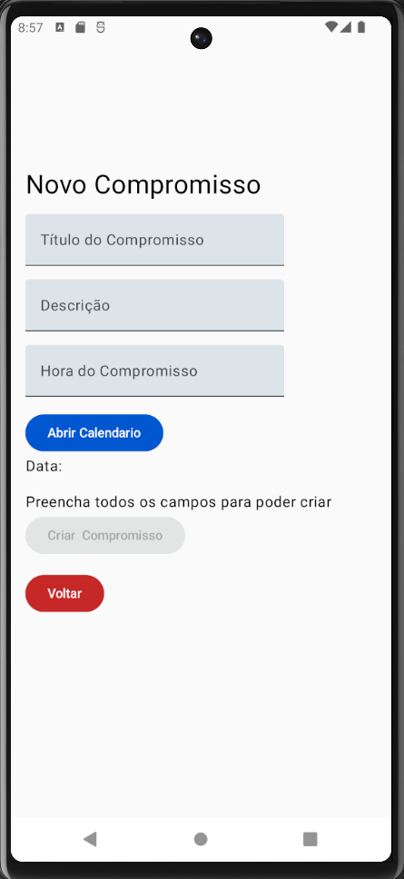
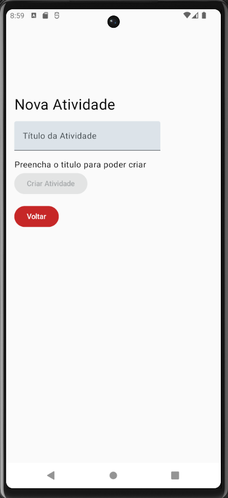
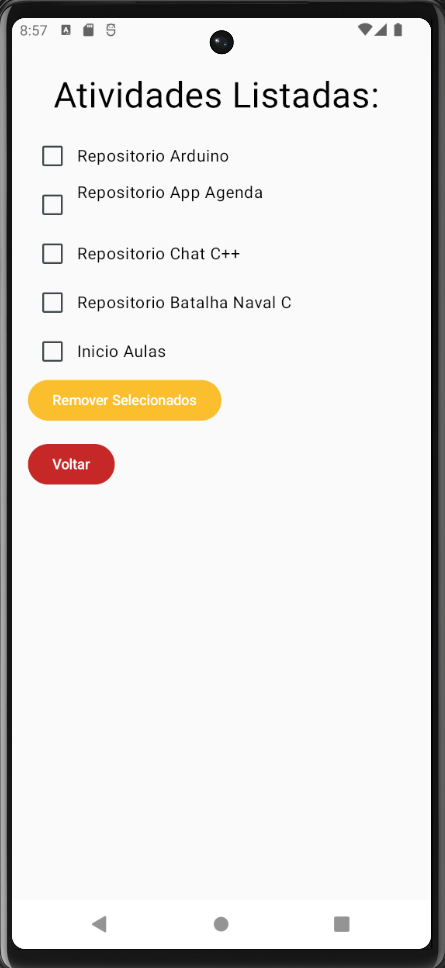

# App Agenda

<p align="center">
  
</p>

Aplicativo Android desenvolvido em **Kotlin** e **Jetpack Compose** para organização de compromissos e atividades.

O aplicativo permite cadastrar compromissos, criar atividades, marcar tarefas como concluídas, acompanhar o progresso do dia e remover itens. Os dados são armazenados localmente utilizando **SQLite**.

---

## Funcionalidades

* Criação de compromissos
* Criação e conclusão de atividades
* Navegação entre diferente telas
* Seleção de data
* Progresso das atividades
* Remoção de itens
* Persistência local com SQLite
* Apk pronto pra instalação

---

## Telas

### Tela Principal

<p align="center">
  
</p>

Exibe os compromissos, atividades e o progresso das tarefas concluídas.

O percentual de progresso é calculado com base na quantidade de atividades concluídas em relação ao total de atividades cadastradas. 

A interface utiliza componentes do Jetpack Compose, como Column, Row, Text, Button, Checkbox, LazyColumn, Image e LinearProgressIndicator.

### Novo Compromisso

<p align="center">
  
</p>


Permite cadastrar título, descrição, horário e data.

A data é selecionada através de um DatePicker, sendo posteriormente formatada para o padrão dd/MM/yyyy.

O botão Criar Compromisso somente fica habilitado quando todos os campos obrigatórios foram preenchidos.

Após a criação, o compromisso é salvo no banco SQLite e adicionado à lista exibida na aplicação.

### Nova Atividade

<p align="center">
  
</p>


Permite criar uma nova atividade que inicialmente fica como não concluída.

Depois de criada, ela é salva no SQLite e adicionada à lista de atividades exibida na tela principal.

### Remover Itens

<p align="center">
  
</p>


A tela de remoção permite selecionar uma ou várias atividades e compromissos utilizando Checkbox.

Após selecionar os itens desejados, o usuário pode utilizar o botão Remover Selecionados.

A remoção acontece tanto no banco de dados quanto nas listas utilizadas pela interface.
---

## Tecnologias e Ferramentas

| Tecnologia             | Utilização                  |
| ---------------------- | --------------------------- |
| **Kotlin**             | Linguagem principal         |
| **Android**            | Plataforma do aplicativo=    |
| **Jetpack Compose**    | Construção da interface     |
| **Material 3**         | Componentes e estilização   |
| **Navigation Compose** | Navegação entre telas       |
| **SQLite**             | Persistência local dos dados      |
| **Android Studio**     | Ambiente de desenvolvimento |

---

## Principais Conceitos

* **`@Composable`** — funções de construção das telas utilizando componentes de interface Jetpack Compose.
* **Componentes de Interface** — `Column`, `Row`, `Text`, `Button`, `TextField`, `Checkbox`, `LazyColumn`, `DatePicker` entre outros.
* **Gerenciamento de Estado** — `remember`, `mutableStateOf` e `mutableStateListOf`.
* **Data Classes** — representação dos objetos `Compromisso` e `Atividade`.
* **Navigation Compose** — navegação através de `NavController`, `NavHost` e rotas.
* **CRUD** — criação, leitura, atualização e exclusão dos registros.

---

## Como Executar 

* **Por APK:**
Para executar o aplicativo, baixe o <a href="./Apk/Agenda.apk"> APK disponível <a> do projeto e instale-o em um dispositivo Android.

> É necessário permitir a instalação de aplicativos de fontes desconhecidas caso o Android solicite.

* **Pelo Projeto no Android Studio:**

1. Clone o repositório:

```bash
git clone https://github.com/Isaque-NR/AppAgenda
```

2. Abra o projeto no **Android Studio**.
3. Aguarde a sincronização das dependências.
4. Execute em um emulador Android ou dispositivo físico.
5. Clique em **Run**.
---

## Objetivo

Projeto desenvolvido para praticar **desenvolvimento Android com Kotlin** na matéria Programação para Dispositivos Móveis, integrando interface com Jetpack Compose, navegação, gerenciamento de estado e persistência de dados.